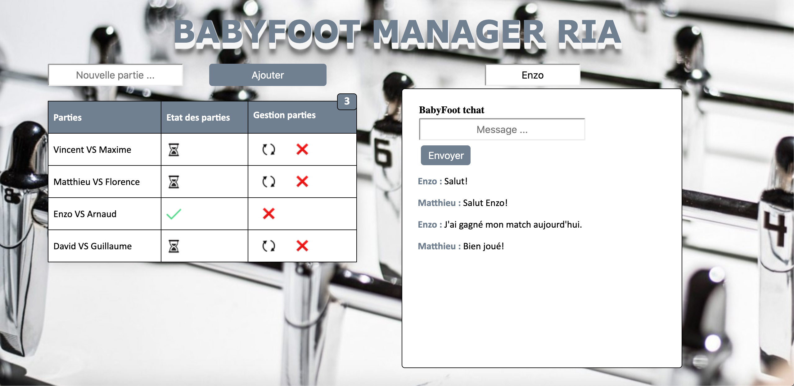

# BF-RIA
This project is a realtime web app which allow the users to create games of babyfoot in a collaborative way and communicate to each other.

## Table of contents
* [General info](#general-info)
* [Technologies](#technologies)
* [Setup](#setup)
* [Features](#features)
* [Incoming features](#incoming-features)
* [BabyFoot Screenshot](#babyfoot-screenshot)

## General info
Babyfoot Manager is a web application of type RIA allowing to create games of babyfoot. Its particularity will be to be able to create parts in a collaborative way.
	
## Technologies
Project is created with:
* Node.js version: 14.2.0
* PostgreSQL version: 12.3
* Socket.io version: 2.3.0
* pgAdmin version: 4.21
	
## Setup
To run this project npm is required.

- Download the project
- Create database in your pgAdmin.
- Restore database sql using the file provided in the data folder (pgsql.sql). 
(Right-click on the database, find file name in the data folder, allow sql format and Restore... "pgsql.sql" )
- In the folder model, open db.js and configure your user, database, password and 5432 port by default.

```
e.g. const pool = new Pool({

  user: "postgres",
  
  database: "bF_RIA",
  
  password: "ismael99",
  
  port: 5432
  
});
```
```
$ npm install

$ npm start

```

Listening on port 3000. 

 > - e.g. http://localhost:3000/

## Features
- Create games with your colleagues
- Overview of on-going games
- Send messages to each other 
- Real-time App

## Incoming features
- Recorded games
- Winners table

## BabyFoot screenshot


